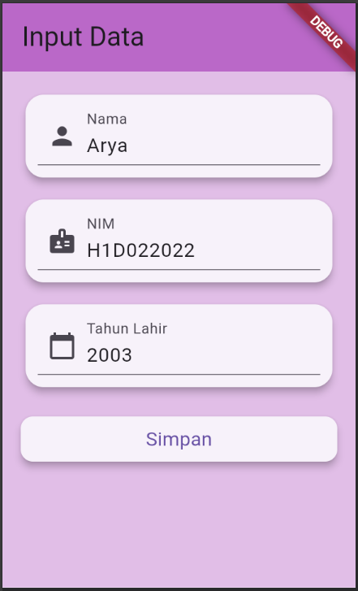
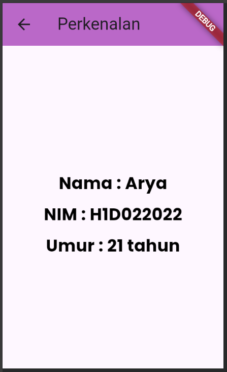

Nama       : Arya Galuh Saputra

NIM        : H1D022022

Shift Baru : B


# Proses Passing Data dari Form ke Tampilan


## 1. Memasukkan Data pada FormData

`TextEditingController` digunakan untuk mengelola masukkan dari user:

```dart
final _namaController = TextEditingController();
final _nimController = TextEditingController();
final _tahunController = TextEditingController();
```

Setiap controller terhubung ke `TextFormField`. `TextFormField` menggunakan controller untuk menyimpan dan memperbarui nilai masukkan user secara otomatis.

## 2. Validasi dan Sending Data

Ketika user menekan button "Simpan", method `_submitForm()` dipanggil:

```dart
void _submitForm() {
  if (_formKey.currentState!.validate()) {
    String nama = _namaController.text;
    String nim = _nimController.text;
    int tahun = int.parse(_tahunController.text);
    
    Navigator.of(context).push(
      PageRouteBuilder(
        pageBuilder: (context, animation, secondaryAnimation) => 
          TampilData(nama: nama, nim: nim, tahun: tahun),
        transitionsBuilder: (context, animation, secondaryAnimation, child) {
          return FadeTransition(opacity: animation, child: child);
        },
      ),
    );
  }
}
```

## 3. Navigasi dan Passing Data

Setelah data terkumpul, `Navigator.of(context).push()` digunakan untuk berpindah ke halaman `TampilData`. Data dikirim sebagai parameter konstruktor:

```dart
TampilData(nama: nama, nim: nim, tahun: tahun)
```

## 4. Receiving Data di TampilData

`TampilData` digunakan untuk menerima data melalui konstruktornya:

```dart
class TampilData extends StatelessWidget {
  final String nama;
  final String nim;
  final int tahun;

  const TampilData({
    super.key,
    required this.nama,
    required this.nim,
    required this.tahun,
  });

}
```

## 5. Menampilkan Data

Method `build` dari `TampilData` menggunakan data yang diterima untuk menampilkan informasi:

```dart
@override
Widget build(BuildContext context) {
  final int umur = DateTime.now().year - tahun;

  _buildInfoRow(context, "Nama", nama),
  _buildInfoRow(context, "NIM", nim),
  _buildInfoRow(context, "Umur", "$umur tahun"),

}
```

## Screenshot :

<div style="display: flex; justify-content: space-between;">
  
  
</div>
